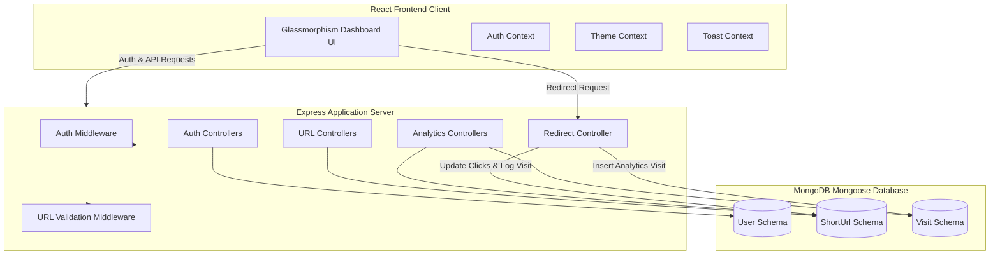

# LinkNova – Smart URL Shortener & Analytics Platform

LinkNova is a production-ready, full-stack URL shortener and real-time visitor analytics platform. Users can register accounts to shorten links, set custom aliases, establish link expiration timelines, generate downloadable QR codes, and inspect click-by-click analytics breakdown including country locations, browser categories, operating systems, and daily click trends via sleek dashboard visualization tools.

---

## 🏗️ Architecture Diagram



---

## 📁 Project Directory Structure

```text
linkpulse/
├── backend/
│   ├── controllers/
│   │   ├── analyticsController.js # Aggregates visitor metrics and summaries
│   │   ├── authController.js      # Handles login, signup, and profile retrieval
│   │   ├── redirectController.js  # Performs 302 redirects and parses analytics
│   │   └── urlController.js       # Handles CRUD and bulk URLs creation
│   ├── middleware/
│   │   ├── auth.js                # JWT validation & optional protection
│   │   ├── error.js               # Global Mongoose / Cast error parser
│   │   └── validate.js            # Destination URL & alias syntax check
│   ├── models/
│   │   ├── User.js                # User model with bcrypt encryption
│   │   ├── ShortUrl.js            # URL model with sparse index for aliases
│   │   └── Visit.js               # Analytical visit record schema
│   ├── routes/
│   │   ├── analytics.js           # Routes for dashboard and URL trends
│   │   ├── auth.js                # Registration, login, profile me route
│   │   └── url.js                 # URL CRUD and bulk imports routing
│   ├── .env                       # Environment configuration
│   ├── package.json               # Backend dependencies
│   ├── seed.js                    # Database seed initializer
│   └── server.js                  # Main server entrypoint
│
├── frontend/
│   ├── src/
│   │   ├── components/
│   │   │   ├── Layout.jsx         # Responsive dashboard wrapper shell
│   │   │   ├── Sidebar.jsx        # Navigation drawers and theme toggle
│   │   │   └── TopNav.jsx         # Header title tracker
│   │   ├── context/
│   │   │   ├── AuthContext.jsx    # Session auth state
│   │   │   ├── ThemeContext.jsx   # Dark/light mode state
│   │   │   └── ToastContext.jsx   # Glassmorphic toast notification queue
│   │   ├── pages/
│   │   │   ├── Analytics.jsx      # Recharts visualizations & recent visit table
│   │   │   ├── CreateUrl.jsx      # Single / Bulk CSV creation forms
│   │   │   ├── Dashboard.jsx      # Stat grid, link table, edit/delete modals
│   │   │   ├── Expired.jsx        # Warning page for expired URLs
│   │   │   ├── Landing.jsx        # Presentation hero & guest shortener
│   │   │   ├── Login.jsx          # Login card
│   │   │   ├── PublicStats.jsx    # Public statistics dashboard
│   │   │   └── Register.jsx       # Account registration card
│   │   ├── App.jsx                # Router config and providers wiring
│   │   ├── index.css              # Global styles (Tailwind imports + custom glass panels)
│   │   └── main.jsx               # React DOM rendering entrypoint
│   ├── index.html                 # HTML viewport, preconnect font files, metadata
│   ├── tailwind.config.js         # Theme color configurations
│   ├── postcss.config.js          # PostCSS tailwind compiler directives
│   └── package.json               # Frontend dependencies
│
└── README.md                      # Platform documentation
```

---

## 🛡️ Database Models (Mongoose Schemas)

### User Model
*   `name` (String, required): Display username.
*   `email` (String, unique, lowercase, required): User email for credentials.
*   `password` (String, required): Bcrypt hashed password.
*   `createdAt` (Date, default `Date.now`): Timestamp of creation.

### ShortUrl Model
*   `userId` (ObjectId, ref User, optional): References the creator (null for anonymous guest creations).
*   `originalUrl` (String, required): Destination target.
*   `shortCode` (String, unique, indexed, required): Short redirection path code.
*   `customAlias` (String, unique, indexed, optional): Customized slug keyword.
*   `clickCount` (Number, default 0): Aggregated clicks.
*   `expiryDate` (Date, optional): Access expiration target.
*   `createdAt` (Date, default `Date.now`): Time created.

### Visit Model
*   `shortUrlId` (ObjectId, ref ShortUrl, indexed): Links to parent short link.
*   `timestamp` (Date, default `Date.now`): Timestamp of visit.
*   `browser` (String, default 'Unknown'): E.g. Chrome, Firefox, Safari.
*   `device` (String, default 'Desktop'): Desktop, Mobile, Tablet.
*   `os` (String, default 'Unknown'): Windows, macOS, Linux, Android, iOS.
*   `country` (String, default 'Unknown'): Geolocated country from IP.
*   `city` (String, default 'Unknown'): Geolocated city from IP.
*   `referrer` (String, default 'Direct'): Hostname origin (e.g. google.com, twitter.com).

---

## 🚀 Installation & Local Execution

### Prerequisites
- Node.js (v18+)
- MongoDB Community Server running locally on port `27017`

### 1. Backend Setup & Run
Open a shell, navigate to the `backend` folder, and configure variables:
```bash
cd backend
npm install
```

Ensure a `.env` file exists in the `backend/` directory:
```env
PORT=5000
MONGODB_URI=mongodb://127.0.0.1:27017/linkpulse
JWT_SECRET=linkpulse_super_secret_session_token_key_987654321
FRONTEND_URL=http://localhost:5173
NODE_ENV=development
```

To seed the database with mock records (1 User, 4 Links, 280+ spread Visits over 10 days for immediate chart viewing):
```bash
npm run seed     # Or directly: node seed.js
```

Start the API and redirection server:
```bash
npm run start    # Starts server on port 5000
```

### 2. Frontend Setup & Run
Open a separate shell terminal, navigate to the `frontend` folder, and execute:
```bash
cd frontend
npm install
npm run dev      # Starts Vite dev server on http://localhost:5173
```

---
## 🎥 Video Explanation

Watch the complete project explanation and demo here:

▶️ YouTube Video: https://youtu.be/WRlmZZvhpII


## 🌐 Production Deployment Guidelines

### 1. Database Deployment (MongoDB)
*   Deploy a managed database cluster using **MongoDB Atlas**.
*   Update the `MONGODB_URI` environment variable on your server hosting provider to point to your secure Atlas connection string:
    `mongodb+srv://<username>:<password>@cluster0.mongodb.net/linknova?retryWrites=true&w=majority`

### 2. Backend Hosting (NodeJS/Express)
*   **Hosting options**: Heroku, Render, AWS Elastic Beanstalk, or DigitalOcean App Platform.
*   Configure the environment variables (`PORT`, `MONGODB_URI`, `JWT_SECRET`, `FRONTEND_URL`, `NODE_ENV=production`) in your hosting console.
*   Set the startup script command to `node server.js`.

### 3. Frontend Hosting (React)
*   **Hosting options**: Vercel, Netlify, or AWS Amplify.
*   Build command: `npm run build` (outputs optimized bundle to `dist/`).
*   Deploy the `dist/` folder.
*   Configure the dashboard build variables so that requests point to the production Backend URL (configure `API_BASE_URL` in `src/context/AuthContext.jsx` or read it from an `.env` variable).
*   Add redirect rules (like `_redirects` for Netlify or `vercel.json` rewrite configs) to redirect all client paths to `/index.html` to allow React Router client-side routing to function correctly.
*   “This project is a part of a hackathon run by https://katomaran.com "
